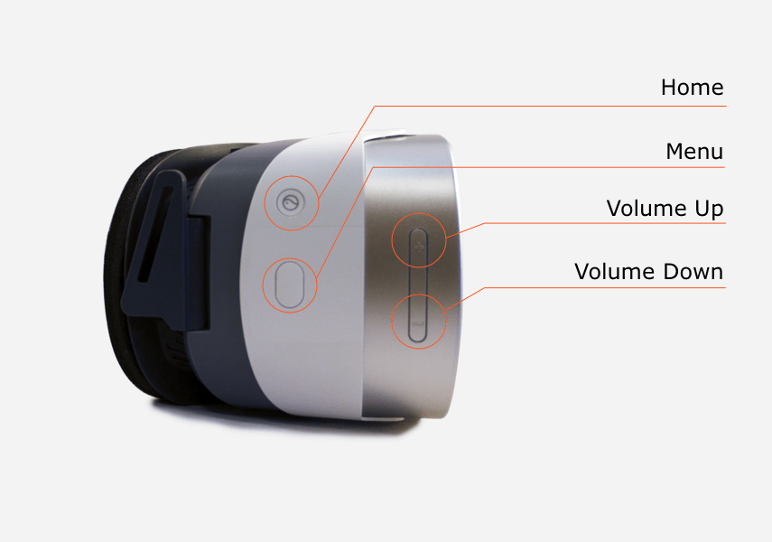
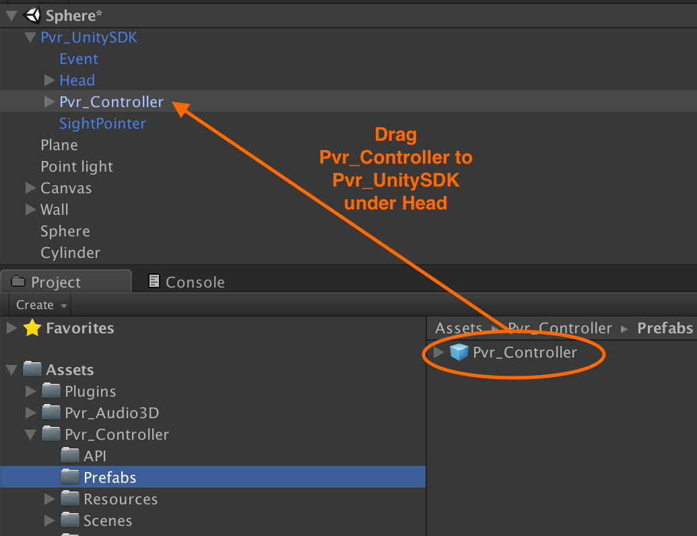

# Pico Goblin headset and Hummingbird controller buttons

#### Headset buttons

The Pico Goblin headset provides basic gaze-based pointer input and some additional buttons for operating system functionality.

<p align="center">
  
</p>

#### Hummingbird controller

Each Pico headset is sold with a Hummingbird input controller that provides more opportunities for the user to interact with virtual reality experiences.

Integrating with the Hummbingbird gamepad is an **optional** step, but is highly encouraged for experiences that can make use of additional forms of input.

<p align="center">
  
</p>

To install, drag the `Assets/Pvr_Controller/Prefabs/Pvr_Controller` prefab into your scene so it appears in `Pvr_UnitySDK` (under `Head`).

<p align="center">
  
</p>

#### Providing fallback headset controls

If it makes sense for your VR app, it is a good idea to provide fallback headset controls when the Hummingbird controller is not available. All Pico headsets are sold with the controller, but users will appreciate the ability to play games when their controller is unavailable.

You can define fallback controls using code similar to the following:

```cs
using Pvr_UnitySDKAPI;

public class MyClass : MonoBehaviour {

    private void Update()
    {
        if (Pvr_UnitySDKAPI.Controller.UPvr_GetControllerState() == Pvr_UnitySDKAPI.ControllerState.Connected)
        {
            // Control system when controller is connected
        } else {
            // Control system when controller is not connected
        }
    }
}
```
