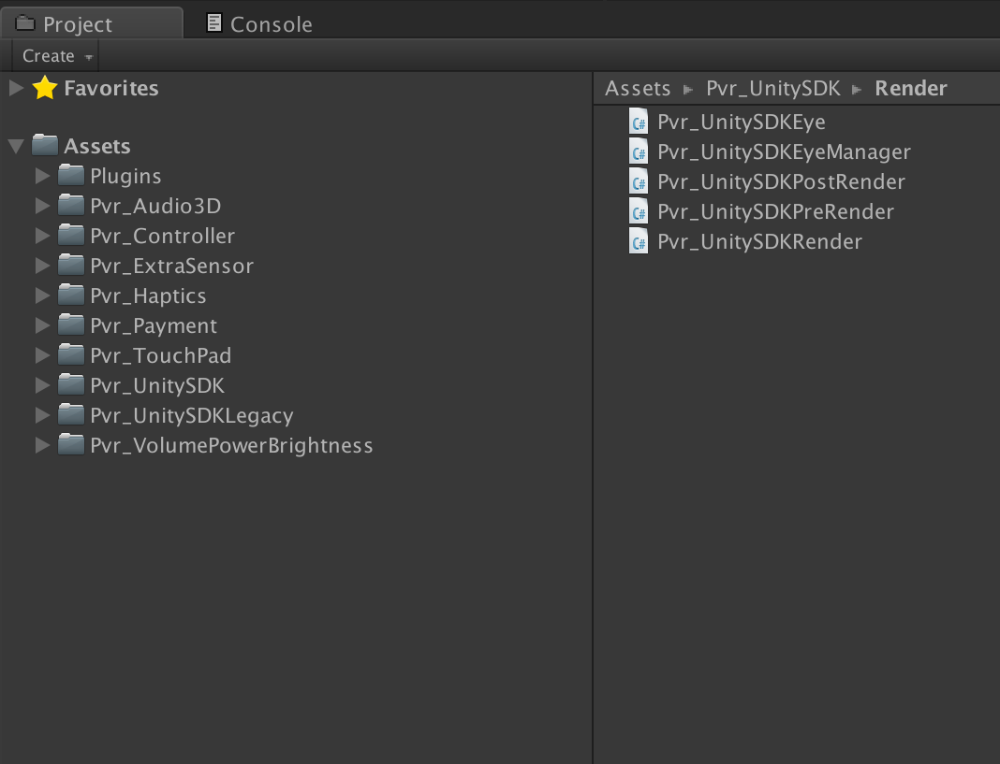

# Pico VR Unity SDK Installation

## Importing the unitypackage

The Pico Unity VR SDK comes as a .unitypackage that you can import into your project via the **Assets › Import Package › Custom Package...** menu option in Unity.

You can <a href="https://users.wearvr.com/developers/devices/pico-goblin/resources/vr-unity-package" target="_blank">download the Pico VR Unity SDK</a> from WEARVR. You will be asked to create or sign in to your developer account.

<p align="center">
  
</p>

This will add a number of directories to your project:

<p align="center">
  
</p>

Delete the existing `MainCamera` from your scene and drag the prefab `PicoMobileSDK/Pvr_UnitySDK/Prefabs/Pvr_UnitySDK.prefab` in to replace it. If necessary, reposition the new camera prefab to where the old one was.

<p align="center">
  
</p>

### Fix broken reference

Unfortunately, there is a bug in the latest version of the SDK that requires fixing. Replace line 944 of `Assets/Pvr_UnitySDK/Pvr_UnitySDKManager.cs`:

```cs
ViewerToast = transform.Find("Head").Find("Viewertoast").gameObject;
```

with the following:

```cs
ViewerToast = transform.Find("Height").Find("Head").Find("Viewertoast").gameObject;
```

## Project settings

### Disable multi-threaded rendering

Open **Edit › Project Settings › Player**. In the Android tab, uncheck **Multithreaded Rendering**

<p align="center">
  
</p>

### Disable the splash screen

As the VR cameras only initialise after the splash screen has been displayed, the splash image does not display correctly in the headset.

If you are using the premium version of Unity, it is recommended to disable the splash screen and set the static splash image to a solid black image in **Project Settings**.

<p align="center">
  
</p>

### Disable bundled Unity VR SDKs

Depending on the version of Unity you are using, the **Virtual Reality Supported** option can be found in **Other Settings** or **XR Settings**. Make sure it is **NOT** checked to avoid conflicts with the Pico VR SDK.

<p align="center">
  
</p>

## Quality Settings

Open **Edit › Project Settings › Quality** and change the following settings:

### Turn off vertical sync

In the **Other** section, change **V sync Count** to **Don’t Sync**

<p align="center">
  
</p>

## AndroidManifest.xml file

If your project does not already have a `Assets/Plugins/Android/AndroidManifest.xml` file, you can use the one installed by the Pico SDK unity package.

If you already have an `AndroidManifest.xml` file in your project, you will need to manually merge in the values found in the unity package’s `AndroidManifest.xml`.

### Next: Camera setup and input

See [Camera & input module setup](/docs/pico-vr-camera-setup.md)
